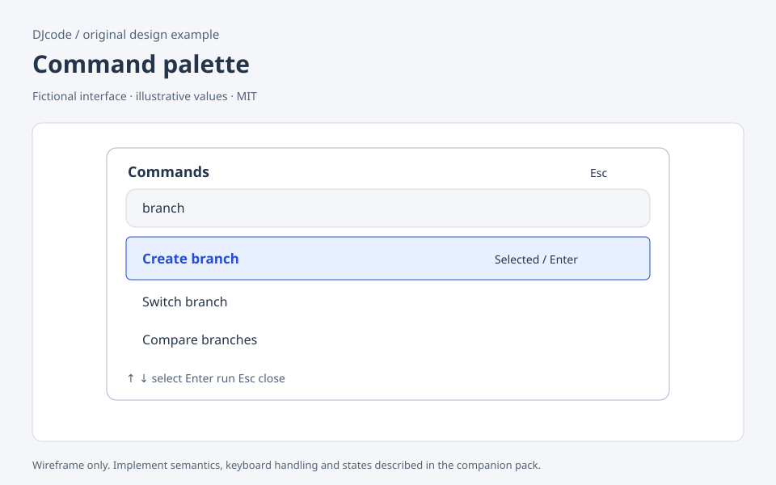

# Command palette

Original DJcode design-context pack · command-palette · reviewed 2026-09-09

Use this as design guidance, not executable application code or a compliance certificate. Adapt it to the repository’s existing components, data contracts and user requirements.

## Example

A fictional editor opens a palette from a visible Commands button or a documented shortcut. Typing “branch” shows “Create branch”, “Switch branch” and “Compare branches”, each with a short consequence. The selected row is visually distinct. Enter chooses the selected row; it never silently falls back to the first result after selection changes.

## Layout and responsiveness

Center a bounded panel near the top of the viewport. Give the query a full-width row and allow only the results area to scroll. Show the command title first; shortcuts and category labels are secondary. On narrow screens, reduce side margins and wrap explanations. Keep a close control visible even with an on-screen keyboard.

## States

Closed; open with no query; matching; results; no match; execution pending; execution error. An empty query can show recent safe commands. A no-match state should echo the query and suggest clearing it. Do not turn free text into a shell command. Commands unavailable in the current context should explain why or be excluded consistently.

## Accessibility and keyboard

Use the APG modal dialog model for the shell: move focus inside, contain tab navigation, close on Escape and restore focus to the trigger. For a query-driven list, implement the combobox/listbox contract including expanded state, active option and accessible names. Arrow keys change the active result; typing remains in the query. Do not use menu roles simply because the UI looks like a menu.

## Implementation

Store query, result IDs and active ID separately. Reset selection deliberately when the result set changes; clamp a removed active item. Search normalized labels and synonyms, preserving stable IDs. Route commands through the same permission and confirmation layer as visible buttons. Cancel outstanding search when closing; do not execute a stale asynchronous result.

## Verification

Open and close by keyboard, then inspect focus restoration. Search, press Down twice, then Enter and verify exactly that command executes once. Test zero results and a result disappearing during search. Try Escape while execution is pending: specify whether it dismisses the panel or cancels work, and label that behavior.

## Sources and license

The layout, prose and accompanying SVG are original DJcode material under the project MIT license. The SVG uses fictional data and is not a working widget. No Mobbin account, paid screenshots, product assets or third-party implementation code are included. Public references inform general interaction principles; they do not endorse this example. APG and WCAG Understanding are guidance; evaluate the completed product against the applicable requirements.

- [W3C modal dialog pattern](https://www.w3.org/WAI/ARIA/apg/patterns/dialog-modal/)
- [W3C combobox pattern](https://www.w3.org/WAI/ARIA/apg/patterns/combobox/)
