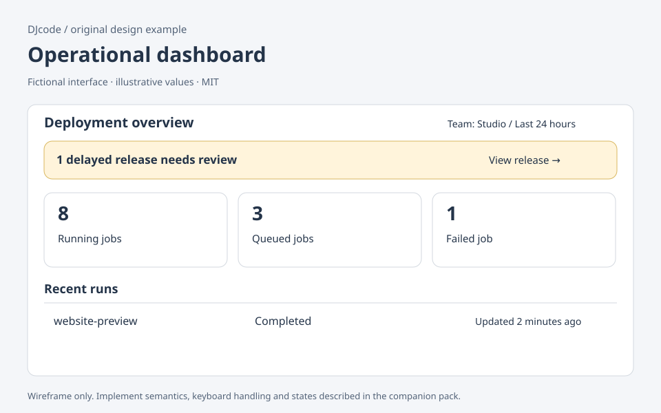

# Operational dashboard

Original DJcode design-context pack · dashboard · reviewed 2026-09-09

Use this as design guidance, not executable application code or a compliance certificate. Adapt it to the repository’s existing components, data contracts and user requirements.

## Example

A fictional deployment console answers: What needs attention now? Place one delayed release above three counters: running jobs, queued jobs and failed jobs. Follow with a recent-runs table. Example values in the diagram are fixtures, not measured results. A team selector and a visible time range control every panel.

## Layout and responsiveness

Use a single page heading and a compact filter row. At wide widths, arrange three metric cards in one row; stack them on narrow screens in decision order. Preserve units and period labels when labels wrap. Keep the urgent item above charts. A trend chart needs a nearby textual summary and a route to its underlying records; never shrink a chart until labels become unreadable.

## States

Loading: reserve panel space and label the request. Fresh: show the observation time. Stale: retain the last result with its age and a refresh action. Partial failure: keep successful panels, identify the failed source. Empty: explain whether the selected period has no records. Zero is valid data; missing is not zero.

## Accessibility and keyboard

Use landmarks, headings and ordinary links for drill-down. Keep a descriptive table available for chart values. Use words and shape as well as color for status. Announce the completion of a user-requested refresh without moving focus; do not read every counter tick aloud.

## Implementation

Model each panel as {data, observedAt, state, error}. Carry team and period in the URL so a copied view is reproducible. Cancel obsolete fetches when filters change. Define whether counts refer to jobs started, finished or active within the period. Avoid adding numbers from incompatible periods. Keep permission checks on the server, including aggregate endpoints.

## Verification

Resize to a 320 CSS pixel viewport and zoom text; all actions must remain reachable. Simulate one failed panel alongside two successful ones. Change the period twice quickly and ensure the old response cannot overwrite the new one. Ask a reviewer to identify the one action requiring attention without reading every metric.

## Sources and license

The layout, prose and accompanying SVG are original DJcode material under the project MIT license. The SVG uses fictional data and is not a working widget. No Mobbin account, paid screenshots, product assets or third-party implementation code are included. Public references inform general interaction principles; they do not endorse this example. APG and WCAG Understanding are guidance; evaluate the completed product against the applicable requirements.

- [W3C status messages](https://www.w3.org/WAI/WCAG22/Understanding/status-messages.html)
- [W3C reflow](https://www.w3.org/WAI/WCAG22/Understanding/reflow.html)
