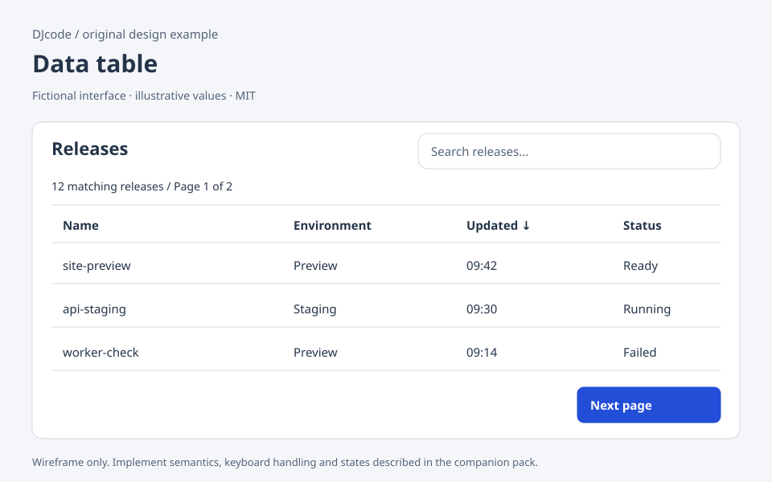

# Data table

Original DJcode design-context pack · data-table · reviewed 2026-09-09

Use this as design guidance, not executable application code or a compliance certificate. Adapt it to the repository’s existing components, data contracts and user requirements.

## Example

A fictional release list contains Name, Environment, Updated and Status columns. A labeled search field filters records; a sortable Updated header shows direction. Each row has a named View release link. Selection checkboxes appear only because a concrete bulk action exists. The toolbar says “3 selected on this page” rather than implying selection of every server record.

## Layout and responsiveness

Use an HTML table for ordinary tabular information. Give it a caption or associated heading. Preserve column relationships on small screens with a labeled horizontally scrollable region; provide a simplified card view only if labels and actions remain equivalent. Keep essential identifying columns visible. Pagination belongs near the record count and includes the current page.

## States

Loading; populated; no records; no filter matches; filtered; sorted; selected; page loading; request failed. Retain filters after failure. Distinguish total records from matching records and page size. A selection spanning pages must say so. A deleted selected record should be removed from selection before a bulk action is confirmed.

## Accessibility and keyboard

Use header cells with scope and communicate sort direction using aria-sort. Sorting controls remain buttons with clear names. A plain table should not intercept arrow keys; interactive grid roles add keyboard obligations and are justified only by cell navigation/editing requirements. Give row checkboxes labels containing a unique record name. Keep focus stable after sorting or pagination.

## Implementation

Represent query, sort direction, page cursor and selection independently. Send stable record IDs, not row indexes, to actions. Use deterministic tie-breaking in server sorting. Reset or preserve selection according to an explicit policy when filters change. Bulk destructive operations require a server-side permission check for every item and a result showing partial failures.

## Verification

Sort duplicate timestamps and check stable ordering. Filter to no matches, clear it and confirm recovery. Select records, move page, then inspect the stated selection scope. Test keyboard activation of header buttons and row links. Verify that a failed bulk operation leaves failed items identifiable rather than announcing blanket success.

## Sources and license

The layout, prose and accompanying SVG are original DJcode material under the project MIT license. The SVG uses fictional data and is not a working widget. No Mobbin account, paid screenshots, product assets or third-party implementation code are included. Public references inform general interaction principles; they do not endorse this example. APG and WCAG Understanding are guidance; evaluate the completed product against the applicable requirements.

- [W3C table pattern](https://www.w3.org/WAI/ARIA/apg/patterns/table/)
- [W3C grid pattern](https://www.w3.org/WAI/ARIA/apg/patterns/grid/)
