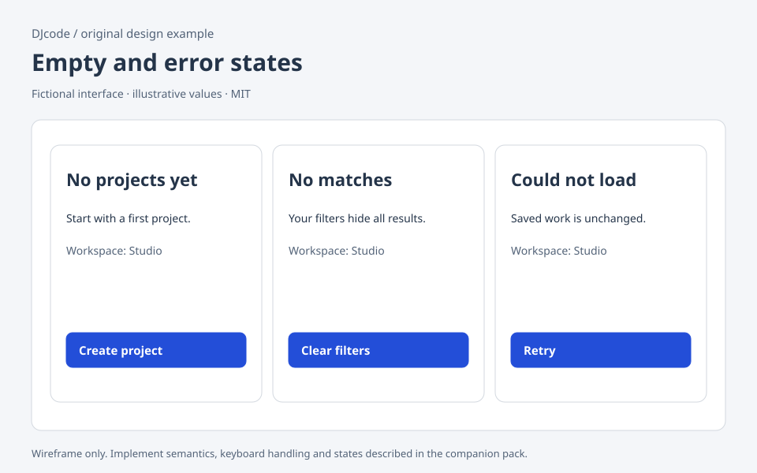

# Empty and error states

Original DJcode design-context pack · empty-error · reviewed 2026-09-09

Use this as design guidance, not executable application code or a compliance certificate. Adapt it to the repository’s existing components, data contracts and user requirements.

## Example

A fictional project list uses three different messages: “No projects yet — Create project”, “No matches for archived — Clear filters”, and “Projects could not load — Retry”. A permission failure offers Request access and names the workspace; it does not reveal protected project titles. Keep the page heading and navigation in every state.

## Layout and responsiveness

Place the message inside the content region that failed. Give it a short heading, one reason when known and one primary recovery action. Avoid full-page illustrations that push recovery below the fold. At narrow widths, stack secondary actions after the primary one. Inline field errors stay beside their fields; a page-level summary can link to each invalid field.

## States

Never created; valid empty result; filtered empty; loading; offline; unauthorized; forbidden; transient server failure; unrecoverable missing resource. Distinguish an empty array from an absent response. Preserve partial results where safe. A retry changes to waiting and is bounded; repeated failure should keep the same recovery controls available.

## Accessibility and keyboard

Associate field error text with its input and mark invalid fields programmatically. Use an appropriate live status for an asynchronous result without forcing focus away from the user’s current task. Reserve assertive alerts for urgent information rather than every failed background refresh. State the problem in words and pair any icon with text.

## Implementation

Map typed error categories to safe user messages. Keep raw stack traces and secret-bearing URLs out of the UI; show a nonsensitive support reference if available. Preserve drafts after a failed save. Retry reads safely; for mutations, reconcile server state or reuse an idempotency key before offering retry. Keep permission handling server-side.

## Verification

Exercise each state with fixtures rather than testing one generic error screen. Turn off the network while editing and confirm the draft survives. Clear filters from an empty result and verify the original list returns. Test repeated retry and screen-reader announcements. Ensure protected data never flashes before a permission error replaces it.

## Sources and license

The layout, prose and accompanying SVG are original DJcode material under the project MIT license. The SVG uses fictional data and is not a working widget. No Mobbin account, paid screenshots, product assets or third-party implementation code are included. Public references inform general interaction principles; they do not endorse this example. APG and WCAG Understanding are guidance; evaluate the completed product against the applicable requirements.

- [W3C error identification](https://www.w3.org/WAI/WCAG22/Understanding/error-identification.html)
- [W3C status messages](https://www.w3.org/WAI/WCAG22/Understanding/status-messages.html)
