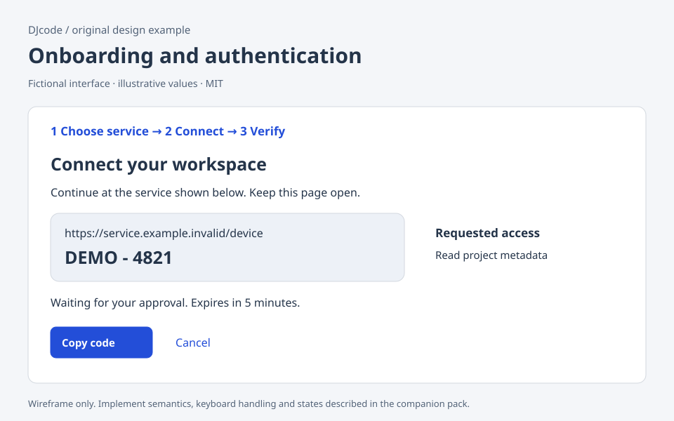

# Onboarding and authentication

Original DJcode design-context pack · onboarding-auth · reviewed 2026-09-09

Use this as design guidance, not executable application code or a compliance certificate. Adapt it to the repository’s existing components, data contracts and user requirements.

## Example

A fictional integration wizard has three steps: Choose service, Connect, Verify. The service page states which authentication methods actually exist. Connect explains where the user will sign in and the requested scope. Verify shows the selected workspace and accessible resource, followed by a Finish button. “Connected” means a verified grant, not merely a completed browser redirect.

## Layout and responsiveness

Use one main column with a short ordered progress indicator. On mobile, shorten completed-step labels but keep the current step name. Put Back and Continue in a consistent location. Avoid a promotional sidebar competing with the next required action. Display a device code as selectable text with a Copy button and an independently readable destination URL.

## States

Unconfigured; method selected; awaiting user; polling; verified; expired; cancelled; permission denied; temporarily offline. Expired authorization starts a new attempt only when the user requests it. Cancelling restores the prior configuration. Existing-account reuse should explain which account is selected without displaying secrets. Unsupported methods are described as unavailable, not offered as broken buttons.

## Accessibility and keyboard

Allow password managers and paste. Do not require memorizing a one-time code while blocking copy/paste; provide an assisted path. Label inputs independently of placeholder text. Announce a material step change and move focus to its heading when appropriate. Polling should not repeatedly interrupt assistive technology; show a stable waiting message and explicit Cancel.

## Implementation

Keep credentials out of URLs, logs and the design example. Use the provider-supported authorization flow and registered client identity; never borrow another application’s client or tokens. Validate state/nonce and PKCE where the actual protocol calls for them. Bound polling, cancel requests and persist configuration only after verification. Model discovery does not prove inference, billing entitlement or write permission.

## Verification

Cancel at every step and compare saved configuration with the initial version. Test expiry, denied scope, revoked tokens and an offline verification response. Paste into credential fields and use a password manager. Confirm sensitive values are absent from logs. Finish must not report success when the verification request fails.

## Sources and license

The layout, prose and accompanying SVG are original DJcode material under the project MIT license. The SVG uses fictional data and is not a working widget. No Mobbin account, paid screenshots, product assets or third-party implementation code are included. Public references inform general interaction principles; they do not endorse this example. APG and WCAG Understanding are guidance; evaluate the completed product against the applicable requirements.

- [W3C accessible authentication](https://www.w3.org/WAI/WCAG22/Understanding/accessible-authentication-minimum.html)
