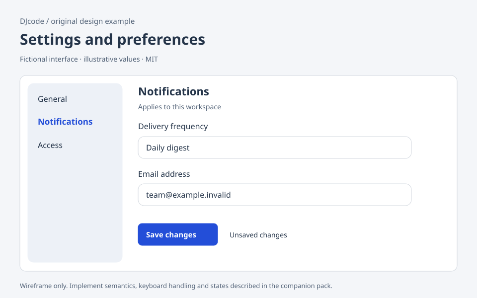

# Settings and preferences

Original DJcode design-context pack · settings · reviewed 2026-09-09

Use this as design guidance, not executable application code or a compliance certificate. Adapt it to the repository’s existing components, data contracts and user requirements.

## Example

A fictional workspace has General, Notifications and Access sections. The Notifications page offers a labeled frequency selector, an email field and a Save changes button. A short scope note says “Applies to this workspace.” A separate destructive section contains Archive workspace; it does not share the Save button.

## Layout and responsiveness

Use a narrow section navigation beside a bounded form on large screens. At small widths, move the section selector above the heading. Keep labels above controls rather than relying on placeholders. Group related fields with a fieldset and legend. Place help below the field it explains. Put the save result beside the save action; avoid a floating bar that covers the last field.

## States

Pristine: no pending changes. Dirty: show that changes are unsaved. Saving: prevent duplicate submission while preserving values. Saved: show confirmation after server acknowledgement. Invalid: retain the attempted values and identify the field. Conflict: offer reload or review if another user changed the same settings. Failed: preserve edits and offer retry.

## Accessibility and keyboard

Prefer native select, checkbox, input and button elements. A toggle should have a stable label and a programmatic checked state. Tab follows the visible field order. If section navigation uses links, keep link behavior; only use tab roles when implementing the full APG tab keyboard model. Route away with unsaved data only after an explicit keep/discard choice.

## Implementation

Separate draft values from the last persisted snapshot. Validate at the server and map errors back to stable field IDs. Use a version/ETag on updates to detect conflicts. Never put credentials in query parameters or analytics. Saving one group should not silently change a different scope. Archive needs its own confirmation naming the workspace and its consequence.

## Verification

Edit a field, trigger a network failure and check that its value survives. Save, reload and verify the server value. Use keyboard-only navigation through the section selector and form. Test an unusually long translated label. Confirm that a stale update cannot overwrite a newer settings version.

## Sources and license

The layout, prose and accompanying SVG are original DJcode material under the project MIT license. The SVG uses fictional data and is not a working widget. No Mobbin account, paid screenshots, product assets or third-party implementation code are included. Public references inform general interaction principles; they do not endorse this example. APG and WCAG Understanding are guidance; evaluate the completed product against the applicable requirements.

- [W3C tabs pattern](https://www.w3.org/WAI/ARIA/apg/patterns/tabs/)
- [W3C error identification](https://www.w3.org/WAI/WCAG22/Understanding/error-identification.html)
