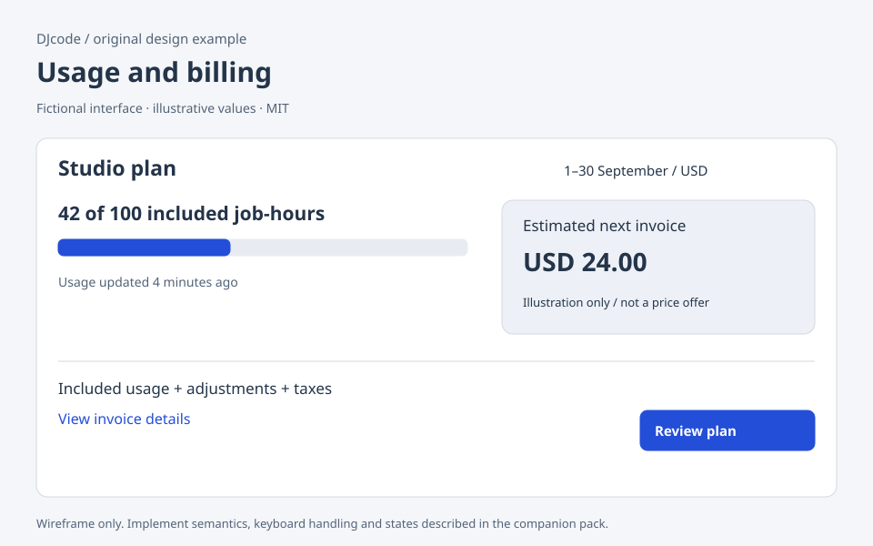

# Usage and billing

Original DJcode design-context pack · usage-billing · reviewed 2026-09-09

Use this as design guidance, not executable application code or a compliance certificate. Adapt it to the repository’s existing components, data contracts and user requirements.

## Example

A fictional workspace displays 42 of 100 included job-hours for a clearly dated billing period. The adjacent amount is labeled “Estimated next invoice”, not “Amount charged”. A details section separates included usage, overage rate, adjustments and taxes. An Upgrade button opens a review step stating the new price, effective date and any proration before committing.

## Layout and responsiveness

Place plan, period and account scope before usage charts. Use a labeled meter with numerical values outside it so a narrow view remains understandable. Put invoice history in a separate table. On mobile, stack current usage, estimate and plan action in that order. Keep the cancel/downgrade route discoverable rather than hiding it behind promotional cards.

## States

No usage; accumulating; near allowance; over allowance; estimate unavailable; payment pending; paid; payment failed; plan change scheduled. Usage data can lag: show when it was updated. An absent price is unavailable, not free. Payment pending is not success. Downgrades may take effect later; show the date and any remaining access.

## Accessibility and keyboard

Describe units, period and monetary currency in text. Do not communicate allowance warnings only through color. Make invoice download links include period and format. Treat plan-change review as a modal dialog with focus handling if it is implemented as a modal. Let users review errors without a short timeout dismissing the explanation.

## Implementation

Use currency minor units or decimal arithmetic rather than binary floating point for invoices. Treat displayed estimates as estimates from the billing service. Submit a plan change with an idempotency key; reconcile the returned status before showing completion. Do not derive final charges solely from a client-side progress meter. Never invent discounts, savings or payment eligibility.

## Verification

Test exactly zero, exactly the allowance and over-limit usage. Render a long currency format and a translated period label. Simulate a timeout after a payment request and verify retry cannot create a duplicate charge. Compare the review total with the confirmation total. Make downgrade and cancel actions reachable by keyboard.

## Sources and license

The layout, prose and accompanying SVG are original DJcode material under the project MIT license. The SVG uses fictional data and is not a working widget. No Mobbin account, paid screenshots, product assets or third-party implementation code are included. Public references inform general interaction principles; they do not endorse this example. APG and WCAG Understanding are guidance; evaluate the completed product against the applicable requirements.

- [W3C modal dialog pattern](https://www.w3.org/WAI/ARIA/apg/patterns/dialog-modal/)
- [W3C error identification](https://www.w3.org/WAI/WCAG22/Understanding/error-identification.html)
